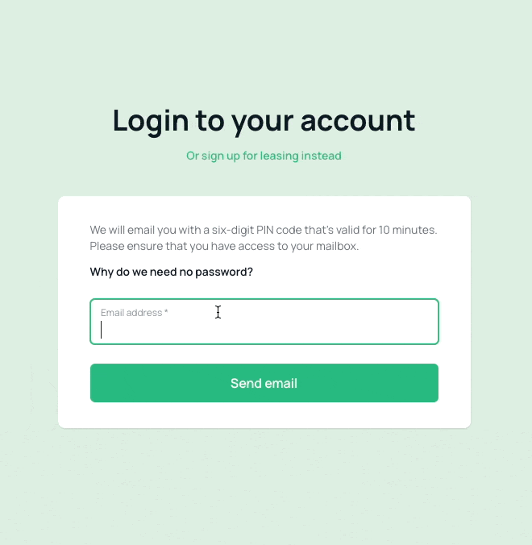

# Laravel PIN Login

[](https://packagist.org/packages/empuxa/laravel-pin-login)
[](https://github.com/empuxa/laravel-pin-login/actions/workflows/run-tests.yml)
[](https://packagist.org/packages/empuxa/laravel-pin-login)


Say goodbye to passwords and sign in via PIN instead! 
Laravel PIN Login is a convenient package that allows you to easily add a PIN login feature to your Laravel application.

## Why Choose Laravel PIN Login?
You might wonder why you should opt for a PIN login instead of a magic link solution. Well, this package is designed to complement the existing login methods in your application. It provides an alternative sign-in option for users who haven't set a password yet or don't have an email address. For instance, users who signed up with only a phone number can still enjoy the benefits of secure login through a PIN.

## Features
- Simplified sign-in process using a PIN
- Compatibility with existing login methods
- Support for users without passwords or email addresses



## Requirements

In addition to Laravel v9.33 or newer, this package relies on [Alpine.js](https://alpinejs.dev/).
If you're using [Laravel LiveWire](https://laravel-livewire.com/), you are already good to go.
Otherwise, ensure to include Alpine.js in your application.
Also, you need to have a notifiable user model.

## Installation

Install the package via composer:

```bash
composer require empuxa/laravel-pin-login
```

Copy the vendor files and adjust the config file `config/pin-login.php` to your needs:

```bash
php artisan vendor:publish --provider="Empuxa\PinLogin\ServiceProvider"
```

Run the migrations:

```bash
php artisan migrate
```

That's it!
You're ready to start using the PIN login feature in your Laravel application.

## Usage

The sign-in process for this repository involves three steps:
1. Enter the user's email address, phone number, or any other specified identifier, and request a PIN.
2. If the entered information is valid, a PIN will be sent to the user. You may need to customize the notification channel based on the user model you are using.
3. Enter the received PIN to log in the user.

### Customizing the Views

While the initial steps are relatively straightforward, it's now necessary to customize the views. 
These views have been designed to be as simple as possible (some might even consider them "ugly") and can be located in the `resources/views/vendor/pin-login` directory.

*Why are they not visually appealing?*
Different applications adopt various layouts and frameworks. 
Since you have the most knowledge about your application, you can change the views to suit your specific requirements.

### Modifying the Notification
Within the copied views, you will come across a notification that's sent to the user. 
You may want to make adjustments to this notification to align it with your preferences and needs.

#### Different Notification Channels
If you plan on utilizing SMS or similar as your preferred notification channel, you have the option to create a custom notification class.
The PIN and the user's IP address will be passed to the constructor of this class. Finally, replace the default notification class within the `config/pin-login.php` file with your custom notification.

### Custom User Model Scope
To apply a scope to your user model, add the following method to your model:

```php
public static function pinLoginScope(): Builder
{
    return self::yourGlobalScope();
}
```

## Testing

```bash
composer test
```

## Changelog

Please see [CHANGELOG](CHANGELOG.md) for more information on what has changed recently.

## Security Vulnerabilities

Please review [our security policy](../../security/policy) on how to report security vulnerabilities.

## Credits

- [Marco Raddatz](https://github.com/marcoraddatz)
- [All Contributors](../../contributors)

## License

The MIT License (MIT). Please see [License File](LICENSE.md) for more information.
